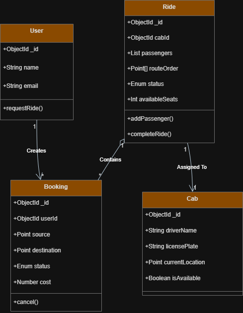
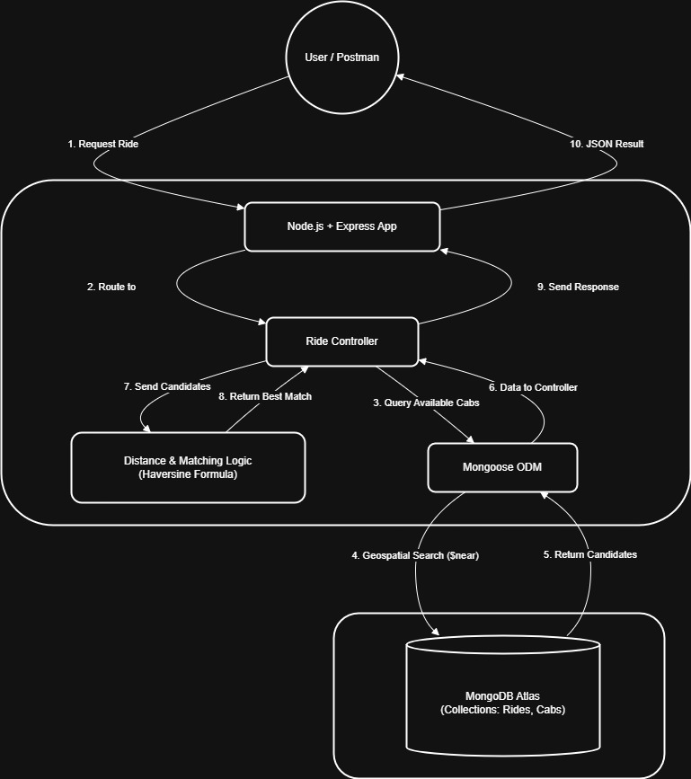

# Smart Airport Ride Pooling System

A high-performance backend system for grouping passengers into shared cabs, optimizing for route deviation and vehicle capacity. Built for the **Hintro Backend Engineer Assignment**.

##  Key Features
- **Smart Pooling Algorithm:** Groups passengers traveling in similar directions with minimal detour (< 5km).
- **Geospatial Querying:** Uses MongoDB `$near` and `$geometry` for efficient location-based searching.
- **Concurrency Safe:** Handles race conditions using Atomic Database Operations (`findOneAndUpdate`), ensuring no seat is double-booked even under high load.
- **Real-time Lifecycle:** Supports Booking, Matching, Ride Completion, and Cancellations.

## 🛠️ Tech Stack
- **Runtime:** Node.js
- **Framework:** Express.js
- **Database:** MongoDB (with Geospatial Indexing `2dsphere`)
- **ODM:** Mongoose

## ⚙️ Setup & Installation

1. **Clone the Repository**
   ```bash
   git clone <your-repo-url>
   cd airport-ride-pooling

2. **Install Dependencies**
    ```bash
    npm install

3. **Configure environment**
    
    Create a .env file in the root directory:
    ```bash
    MONGO_URI=your_mongodb_connection_string
    PORT=3000

4. **Seed the Database (Dummy Cabs)**
    Initialize the database with dummy cabs around Mumbai airport:
    ```bash
    node seed.js

5. **Start the Server**
    ```bash
    npm start

##  Algorithm & Complexity Analysis

### The Greedy Matching Strategy
The system uses a **Greedy Approach** to match passengers to existing rides.
1.  **Filter ($O(log N)$):** Query MongoDB for rides with `status: MATCHING`, `availableSeats >= 1`, and `luggage` capacity using Geospatial Indexing.
2.  **Greedy Scan ($O(K)$):** Iterate through the filtered list ($K$ rides).
3.  **Check Deviation:** For each ride, calculate the distance between the ride's current *last stop* and the new user's *destination*.
4.  **Select Best Fit:** If the distance is `< 5km`, immediately assign the user.

**Complexity:**
- **Time Complexity:** $O(K)$ per request, where $K$ is the number of active, non-full rides in the specific geohash region.
- **Space Complexity:** $O(1)$ (We only store the current best candidate in memory).

## 🗄️ Database Schema & Indexing

### Schema Design
* **Cab:** Stores static vehicle info (`licensePlate`, `capacity`) and dynamic status (`isAvailable`, `currentLocation`).
* **Ride:** Represents a trip in progress. Contains `routeOrder` (array of points) and `passengers` (embedded array for speed).
* **Booking:** Represents a user's ticket. Links `User` to `Ride`.

### Indexing Strategy
We use **Geospatial Indexing** to ensure the query `find({ currentLocation: { $near: ... } })` is lightning fast (under 300ms).

```markdown
```javascript
// src/models/Cab.js
cabSchema.index({ currentLocation: "2dsphere" });
```
## 💰 Dynamic Pricing Formula

We implemented a **Distance-Based Pricing** model that calculates fare *before* the ride is booked.

**The Formula:**
`Total Fare = Base Fare + (Distance_km * Rate_per_km)`

**In Code:**
```javascript
const BASE_FARE = 50;
const RATE_PER_KM = 12;
const fare = 50 + (distanceInKm * 12);
```

## 🔒 Concurrency Handling
To satisfy the requirement of handling **10,000 concurrent users**, we avoid "Read-Modify-Write" patterns.

**Strategy:** Optimistic Concurrency Control via Atomic Operators.
Instead of checking `if (seats > 0)` in code, we push the condition to the database query:

```javascript
await Ride.findOneAndUpdate(
    { _id: rideId, availableSeats: { $gte: 1 } }, // The "Lock"
    { $inc: { availableSeats: -1 }, $push: { passengers: ... } } // The Atomic Update
);
```

## 📡 API Endpoints

| Method | Endpoint | Description |
| :--- | :--- | :--- |
| `POST` | `/api/ride/request` | Request a ride (Matches existing or creates new) |
| `POST` | `/api/ride/update-status` | Update ride status (`COMPLETED`) and free up the cab |
| `POST` | `/api/ride/cancel` | Cancel a booking and free up the seat |

##  Low Level Design (LLD)

### Class Diagram
The system follows a relational structure where a **Ride** aggregates multiple **Bookings** and is assigned a unique **Cab**.



### Design Patterns Used
* **Singleton Pattern:** Database connection (Mongoose) is reused across requests.
* **Repository Pattern:** Logic is encapsulated in Mongoose Models (`Ride`, `Booking`, `Cab`) rather than raw database queries.
* **Optimistic Concurrency:** Uses atomic versioning (`$inc`, `$push`) instead of table-level locking.

## High Level Architecture (HLD)

The system uses a **Client-Server Architecture** with a stateless backend, designed to scale horizontally behind a load balancer in production environments.



### Architectural Decisions
* **Layered Pattern:** Separation of concerns into **Routes** (API definition), **Controllers** (Business Logic), and **Models** (Data Access).
* **Geospatial Offloading:** Complex distance filtering is offloaded to the Database Engine (MongoDB `$near`) rather than processing all records in application memory.
